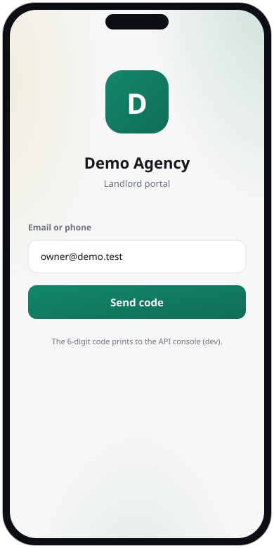
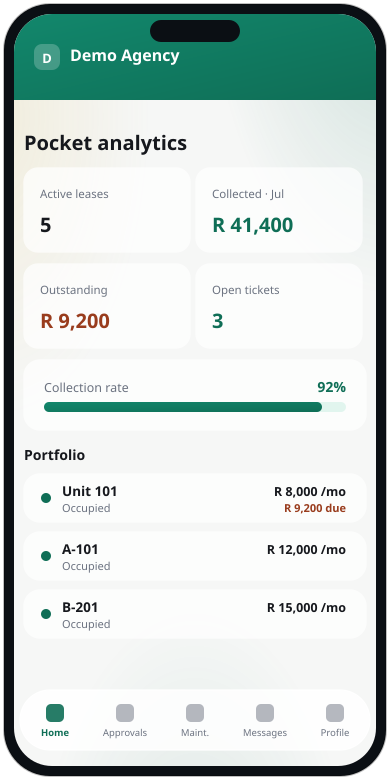
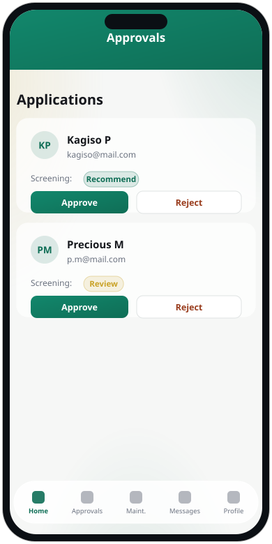
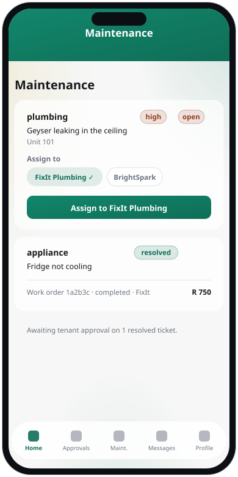
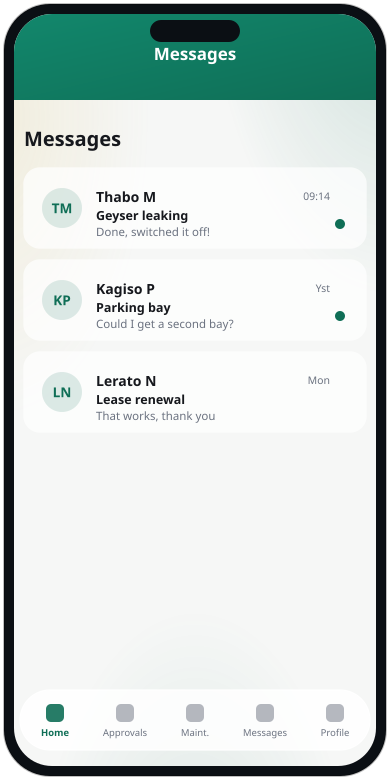
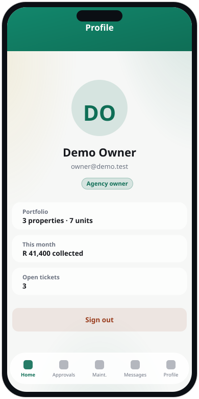

# Landlord App — User Manual

The landlord app is the on-the-go companion for agency staff (owners and property
managers). It's a focused, mobile view for keeping the portfolio moving:
pocket analytics, approving applications, dispatching maintenance, and messaging
tenants. This guide covers every screen.

> The landlord app shares its branding with the tenant app and web console. Set
> both apps to the same vendor so the look matches.

**Contents**
Signing in · Dashboard · Approvals · Maintenance · Messages · Profile

---

## Signing in

Sign in with your staff email (e.g. `owner@demo.test`) and the six-digit code
sent to you — the same passwordless login as the web console. Your role
(agency owner or property manager) determines what you can do.

---

## Dashboard

**Pocket analytics** for the whole portfolio: active leases, rent collected this
period, total outstanding, and open tickets. The **collection rate** bar tracks
the month, and the **Portfolio** list shows each unit, whether it's occupied, its
rent, and any amount due. Pull down to refresh.

---

## Approvals

New rental applications waiting on you. Each card shows the applicant, their
contact, and the screening recommendation. **Approve** to create the lease, or
**Reject** — the same decisions available in the web console, in your pocket.

---

## Maintenance

Every maintenance ticket. For an open ticket, pick a **service provider** to
assign it to — providers whose category matches the ticket (e.g. a plumber for a
plumbing job) are listed first and ticked — then tap **Assign**. As the job
progresses you **Start** and **Complete** the work order (entering the cost,
which posts to the ledger). Resolved tickets then wait for the tenant to approve
and close them.

---

## Messages

Your tenant inbox. Conversations are listed newest-first with unread dots and the
last message preview; tap one to read the thread and reply. New tenant messages
arrive without refreshing.

---

## Profile

Your account and a quick portfolio summary — properties and units managed, rent
collected this month, and open tickets — with **Sign out** at the bottom.

---

*This app is a companion to the web back office. For portfolio setup, billing runs,
owner statements, reports and branding, use the web console (see the Staff
manual).*
