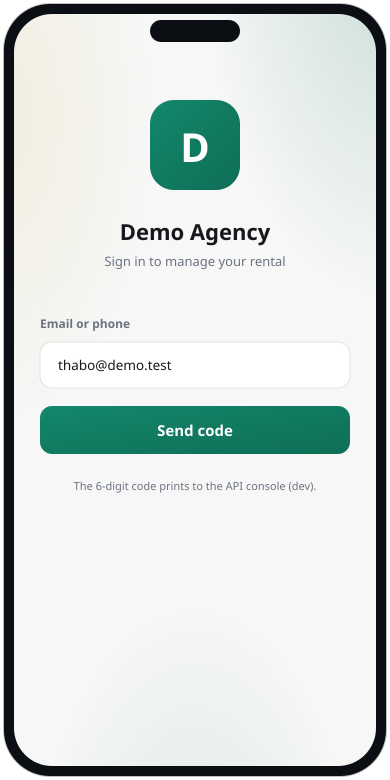
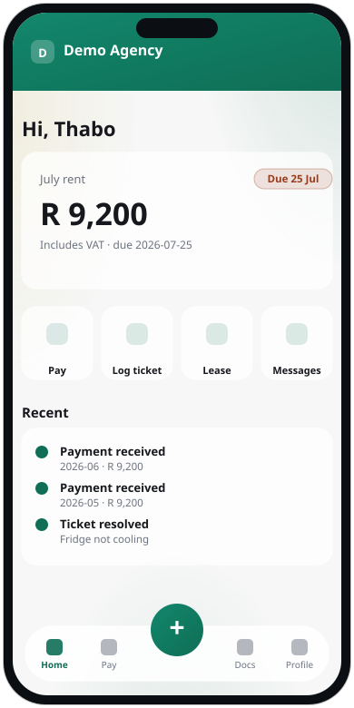
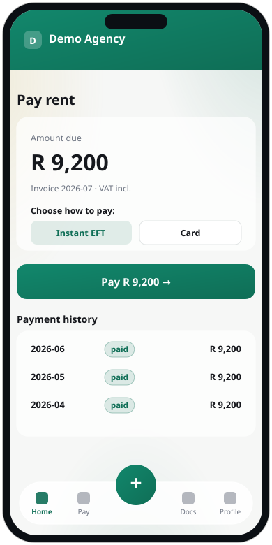
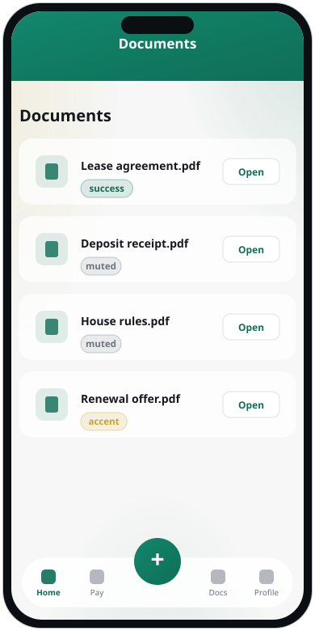
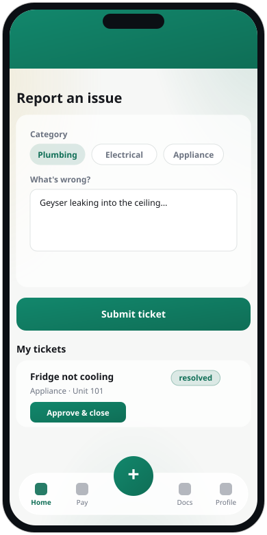
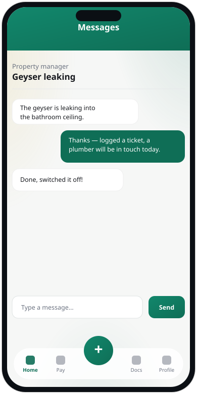
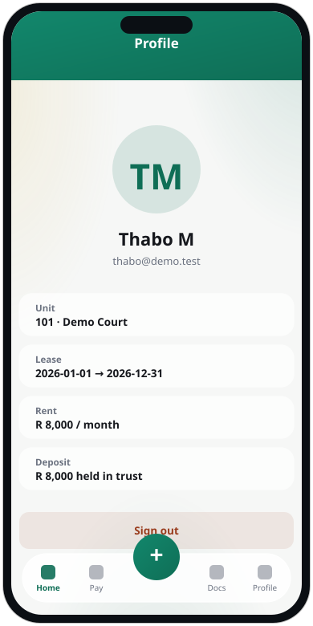

# Tenant App — User Manual

The tenant app is how residents pay rent, log maintenance, read their documents
and message the property manager — from their phone. This guide walks through
every screen.

> Screenshots use the seeded demo brand. Your building's own logo and colours
> appear once your managing agent sets them.

**Contents**
Signing in · Home · Pay rent · Documents · Report an issue (Maintenance) ·
Messages · Profile

---

## Signing in

There's no password. Type the email or phone number your agent has on file and
tap **Send code**. A six-digit code arrives by SMS or email (in a demo build it
prints to the server console). Enter it and you're in — the app stays signed in
on your device.

---

## Home

Your home screen leads with **what you owe** — the current month's rent, the due
date, and a **Pay rent** button. Below it, four quick tiles jump to **Pay**,
**Log ticket**, **Lease** and **Messages**, and a **Recent** list shows your
latest payments and resolved tickets. The bar along the bottom is your main
navigation; the raised **+** button in the middle opens *Report an issue* from
anywhere.

---

## Pay rent

Tap **Pay rent** to see the amount due and choose a method — **Instant EFT** or
**Card** — then confirm. You're taken to the secure payment page to complete it;
once the payment clears, the invoice is marked paid automatically. Your full
**payment history** is listed underneath, each marked *paid*.

---

## Documents

Everything your agent has shared with you — your lease agreement, deposit
receipt, house rules and any notices. Tap **Open** to view or download a
document. Items marked *Awaiting signature* need your e-signature; open them to
sign.

---

## Report an issue (Maintenance)

Tap the centre **+** button to log a maintenance problem. Pick a **category**
(plumbing, electrical, appliance, and so on), describe **what's wrong**, and tap
**Submit ticket**. Your existing tickets appear below with their status. When a
job is fixed, the ticket shows *resolved* with an **Approve & close** button —
tap it to confirm the work is done to your satisfaction.

---

## Messages

Chat directly with your property manager. Tap **New** to start a conversation
(give it a subject and your message), or open an existing thread to continue it.
Replies from your manager arrive here, and you'll see a dot on the Messages tab
when there's something unread.

---

## Profile

Your details at a glance — your unit, lease term, monthly rent and the deposit
held in trust for you. The **Sign out** button lives here at the bottom.

---

*Trouble signing in or something not right? Contact your managing agent — their
phone and email are shown on the app's branding.*
